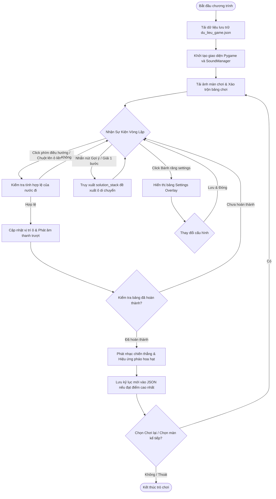
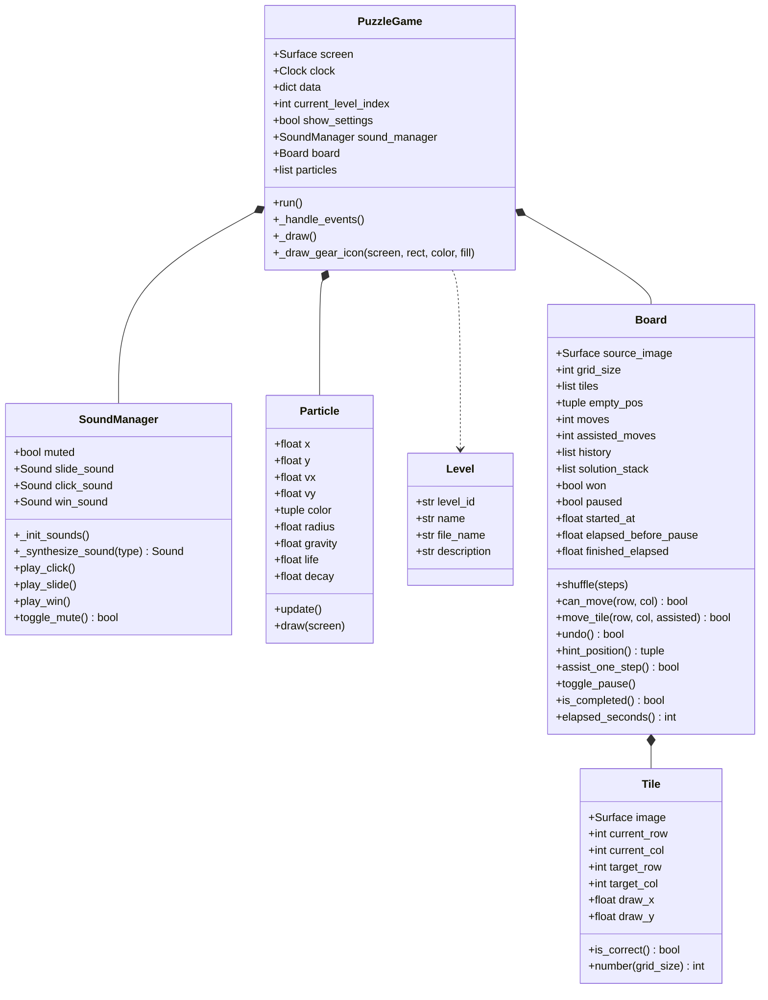
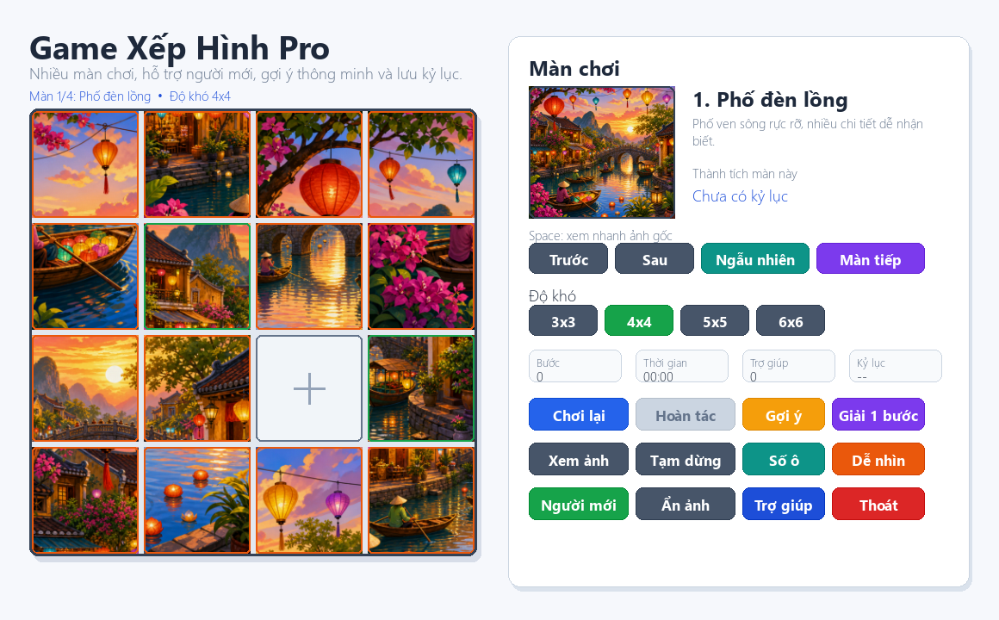

# BÁO CÁO ĐỒ ÁN MÔN HỌC
## ĐỀ TÀI: NGHIÊN CỨU NGÔN NGỮ PYTHON VÀ LẬP TRÌNH GAME TRƯỢT HÌNH "PUZZLE GAME" BẰNG THƯ VIỆN PYGAME

---

## LỜI CẢM ƠN

Trong quá trình thực hiện đồ án môn học này, em xin bày tỏ lòng biết ơn sâu sắc đến các thầy cô giáo khoa Công nghệ thông tin đã truyền đạt kiến thức và tận tình hướng dẫn, giúp đỡ em trong suốt quá trình nghiên cứu và thực hiện đề tài. Những kiến thức quý báu học được từ thầy cô là nền tảng vững chắc giúp em hoàn thành sản phẩm này.

Em cũng xin gửi lời cảm ơn tới cộng đồng lập trình mã nguồn mở Pygame/Pygame-CE trên Internet, nơi đã chia sẻ rất nhiều tài liệu kỹ thuật, giải thuật hữu ích và kinh nghiệm thực tế giúp em tháo gỡ các vướng mắc trong suốt quá trình xây dựng trò chơi.

Mặc dù đã cố gắng hoàn thiện đồ án một cách chỉn chu nhất, song do giới hạn về mặt thời gian và kinh nghiệm thực tiễn, báo cáo không tránh khỏi những thiếu sót. Em rất mong nhận được sự quan tâm, đóng góp ý kiến từ các thầy cô giáo để đồ án hoàn thiện và phát triển tốt hơn trong tương lai.

*Sinh viên thực hiện*  
**Đỗ Xuân Trung**

---

## MỤC LỤC

* **LỜI CẢM ƠN**
* **MỤC LỤC**
* **DANH MỤC TỪ VIẾT TẮT**
* **DANH MỤC HÌNH ẢNH**
* **MỞ ĐẦU**
* **CHƯƠNG 1: TỔNG QUAN VỀ CÔNG NGHỆ**
* **CHƯƠNG 2: PHÂN TÍCH VÀ THIẾT KẾ HỆ THỐNG**
* **CHƯƠNG 3: HIỆN THỰC CHƯƠNG TRÌNH VÀ KẾT QUẢ**
* **KẾT LUẬN VÀ HƯỚNG PHÁT TRIỂN**
* **TÀI LIỆU THAM KHẢO**

---

## DANH MỤC TỪ VIẾT TẮT

| Từ viết tắt | Nghĩa tiếng Anh | Nghĩa tiếng Việt |
| :--- | :--- | :--- |
| **OOP** | Object-Oriented Programming | Lập trình hướng đối tượng |
| **IDE** | Integrated Development Environment | Môi trường phát triển tích hợp |
| **UI** | User Interface | Giao diện người dùng |
| **UX** | User Experience | Trải nghiệm người dùng |
| **FPS** | Frames Per Second | Số khung hình trên giây |
| **LERP** | Linear Interpolation | Nội suy tuyến tính |
| **SDL** | Simple DirectMedia Layer | Thư viện phát triển đa phương tiện đơn giản |
| **JSON** | JavaScript Object Notation | Định dạng trao đổi dữ liệu gọn nhẹ |
| **PCM** | Pulse Code Modulation | Mã hóa xung mã (âm thanh số thô) |
| **BFS** | Breadth-First Search | Thuật toán tìm kiếm theo chiều rộng |
| **A*** | A-star Algorithm | Thuật toán tìm đường đi ngắn nhất A-sao |
| **API** | Application Programming Interface | Giao diện lập trình ứng dụng |
| **RAM** | Random Access Memory | Bộ nhớ truy cập ngẫu nhiên |
| **OS** | Operating System | Hệ điều hành |

---

## DANH MỤC HÌNH ẢNH

* Hình 3.1: Ảnh gốc màn chơi "Phố đèn lồng"
* Hình 3.2: Ảnh gốc màn chơi "Đảo nhiệt đới"
* Hình 3.3: Ảnh gốc màn chơi "Thành phố sao"
* Hình 3.4: Ảnh gốc màn chơi "Vườn núi"
* Hình 3.5: Giao diện chính của trò chơi Puzzle Game sau khi nâng cấp thẩm mỹ

---

## MỞ ĐẦU

### 1.1. Lý do chọn đề tài
Lập trình trò chơi (Game Development) là một lĩnh vực hấp dẫn, kết hợp hài hòa giữa tư duy thuật toán, thiết kế đồ họa, tương tác người dùng và âm thanh. Với sinh viên ngành Công nghệ thông tin, việc phát triển một trò chơi từ con số không là cơ hội tuyệt vời để củng cố kiến thức lập trình hướng đối tượng (OOP), nâng cao tư duy giải quyết vấn đề và làm quen với quy trình xây dựng phần mềm thực tế.

Trong các thể loại game, trò chơi trượt hình giải đố (Sliding Puzzle / 15-Puzzle) là một trong những tựa game trí tuệ kinh điển nhất thế giới. Trò chơi tuy có luật chơi đơn giản nhưng đòi hỏi tư duy logic cao, khả năng lập kế hoạch nước đi và tính toán các thuật toán xáo trộn/giải mã để hỗ trợ người chơi. Việc nghiên cứu ngôn ngữ Python và xây dựng game trượt hình bằng thư viện Pygame giúp học hỏi sâu sắc về đồ họa 2D, quản lý vòng lặp game (Game Loop), xử lý sự kiện (Event Handling), hoạt hình mượt mà (Animations) và tổng hợp âm thanh số trực tiếp từ mã nguồn.

### 1.2. Mục tiêu đồ án
* **Về mặt lý thuyết:** Nghiên cứu sâu về ngôn ngữ lập trình Python, mô hình lập trình hướng đối tượng (OOP) và cơ chế vẽ đồ họa 2D của thư viện Pygame/Pygame-CE.
* **Về mặt thực hành:** Xây dựng ứng dụng trò chơi "Puzzle Game" hoàn chỉnh, chạy mượt mà trên hệ điều hành Windows với các tiêu chuẩn thiết kế hiện đại:
  - Cho phép người chơi chọn nhiều màn hình với hình ảnh phong cảnh chất lượng cao.
  - Hỗ trợ nhiều kích thước lưới từ dễ đến khó (3x3, 4x4, 5x5, 6x6).
  - Tích hợp các chức năng thông minh: Hoàn tác nước đi (Undo), Gợi ý bước giải tối ưu (Hint), Tự động di chuyển một bước giải (Assist).
  - Tối ưu hóa giao diện người dùng (UI/UX) với các nút bấm đối xứng, ô chỉ số kiểu Widget hiện đại, hoạt ảnh LERP chuyển động ô trượt mượt mà.
  - Tổng hợp âm thanh số trực tiếp thông qua lập trình buffer sóng sin mà không cần dùng đến tệp âm thanh bên ngoài, giúp game gọn nhẹ và tránh lỗi mất file tài nguyên.
  - Tạo cơ chế lưu trữ tự động kỷ lục màn chơi (thời gian tốt nhất, số bước đi ít nhất) vào tệp cấu hình JSON để tăng tính cạnh tranh.

### 1.3. Phạm vi đề tài
* Xây dựng trò chơi "Puzzle Game" chạy ngoại tuyến (offline) trên máy tính cá nhân chạy hệ điều hành Windows.
* Phát triển bằng ngôn ngữ Python sử dụng thư viện Pygame-CE làm nhân đồ họa chính.

---

## CHƯƠNG 1: TỔNG QUAN VỀ CÔNG NGHỆ

### 2.1. Ngôn ngữ lập trình Python
#### 2.1.1. Khái niệm Python
Python là ngôn ngữ lập trình bậc cao, thông dịch, đa mục đích và mã nguồn mở. Được thiết kế với triết lý nhấn mạnh vào sự rõ ràng, dễ đọc của cú pháp (readability), Python giúp các lập trình viên viết các đoạn mã ngắn gọn nhưng hiệu quả, tập trung tối đa vào việc giải quyết bài toán cốt lõi thay vì các cú pháp phức tạp như các ngôn ngữ C++ hay Java.

#### 2.1.2. Lịch sử phát triển
* **1989-1991:** Python được khởi xướng bởi Guido van Rossum tại CWI (Hà Lan) như một dự án kế thừa ngôn ngữ ABC. Phiên bản 0.9.0 được phát hành vào tháng 2/1991.
* **1994:** Python 1.0 ra mắt, bổ sung các công cụ lập trình chức năng cốt lõi như `lambda`, `map`, `filter` và `reduce`.
* **2000:** Python 2.0 giới thiệu cơ chế thu gom rác tự động (Garbage Collection) và hỗ trợ đầy đủ Unicode.
* **2008:** Python 3.0 (còn gọi là Py3K) được phát hành. Đây là một bước ngoặt lớn tái cấu trúc ngôn ngữ để loại bỏ các tính năng dư thừa, hướng tới sự tinh giản, chấp nhận không tương thích ngược hoàn toàn với phiên bản 2.
* **Hiện nay:** Python liên tục nằm trong top những ngôn ngữ lập trình phổ biến nhất toàn cầu, là xương sống cho các lĩnh vực hàng đầu như Trí tuệ nhân tạo (AI/Machine Learning), Khoa học dữ liệu (Data Science), Phát triển Web và Tự động hóa hệ thống.

#### 2.1.3. Đặc điểm nổi bật
* **Cú pháp trong sáng, trực quan:** Sử dụng các khoảng thụt lề (indentation) để phân tách khối lệnh thay cho các cặp ngoặc nhọn `{}` hay từ khóa như `begin`/`end`.
* **Mã nguồn mở và đa nền tảng:** Chạy đồng nhất trên Windows, macOS, Linux.
* **Hệ sinh thái thư viện khổng lồ:** Có hàng trăm ngàn thư viện mở rộng được đóng góp bởi cộng đồng qua kho ứng dụng PyPI, hỗ trợ giải quyết hầu hết mọi bài toán kỹ thuật nhanh chóng.

### 2.2. Thư viện đồ họa Pygame và Pygame-CE
#### 2.2.1. Giới thiệu chung
Pygame là một thư viện đa nền tảng dành cho Python được thiết kế để viết các trò chơi điện tử đồ họa 2D. Pygame liên kết trực tiếp với thư viện SDL (Simple DirectMedia Layer) viết bằng ngôn ngữ C, cho phép lập trình viên tương tác trực tiếp với bộ nhớ đồ họa, quản lý luồng âm thanh, camera và các thiết bị ngoại vi như chuột, bàn phím hay tay cầm chơi game.

#### 2.2.2. Sự khác biệt của Pygame-CE (Community Edition)
Trong dự án này, mã nguồn sử dụng nhánh nâng cấp hiện đại mang tên **Pygame-CE (Community Edition)**. Đây là phiên bản fork chính thức từ Pygame truyền thống do cộng đồng phát triển tích cực hơn với các ưu điểm vượt trội:
* **Hiệu năng vượt trội:** Các API vẽ hình học được tối ưu hóa bằng C, cho tốc độ render khung hình (FPS) cao và ổn định hơn rất nhiều.
* **Xử lý Font chữ cải tiến:** Khắc phục nhiều lỗi rò rỉ bộ nhớ (memory leaks) khi kết xuất chữ văn bản liên tục ở tần số cao.
* **Hỗ trợ định dạng âm thanh tốt hơn:** Cho phép truyền dữ liệu buffer dạng thô trực tiếp vào thiết bị mixer, tạo điều kiện thuận lợi cho cơ chế tổng hợp âm thanh bằng toán học.

#### 2.2.3. Các mô-đun cốt lõi trong Pygame
* `pygame.display`: Thiết lập cửa sổ trò chơi, độ phân giải, tiêu đề màn hình và quản lý cập nhật vùng đệm kép (Double Buffering) để loại bỏ hiện tượng giật hình.
* `pygame.event`: Hộp thư chứa các sự kiện hệ thống (nhấp chuột, nhấn phím, tắt cửa sổ) phát sinh liên tục trong quá trình trò chơi vận hành.
* `pygame.image` & `pygame.Surface`: Xử lý nạp ảnh từ bộ nhớ, cắt ghép vùng ảnh (subsurface) và thực hiện các bộ lọc kéo giãn kích thước (scaling).
* `pygame.mixer`: Quản lý hệ thống âm thanh đa kênh (channels), phát nhạc nền và các hiệu ứng âm thanh đặc biệt (SFX).
* `pygame.draw`: Vẽ các đường hình học vector trực tiếp lên màn hình như hình tròn, đa giác, đường thẳng.

### 2.3. Quy trình cài đặt môi trường lập trình
Quy trình thiết lập môi trường phát triển trò chơi trên hệ điều hành Windows bao gồm các bước:
1. **Cài đặt Python Interpreter:** Tải trình biên dịch Python phiên bản 3.10 trở lên từ trang chủ `python.org`, chạy file cài đặt và tích chọn mục **"Add Python to PATH"** để có thể chạy lệnh trực tiếp từ Terminal.
2. **Thiết lập IDE/Editor:** Sử dụng Visual Studio Code (VS Code) và cài đặt extension `Python` để hỗ trợ gợi ý từ khóa và gỡ lỗi trực quan.
3. **Cài đặt thư viện đồ họa thông qua PIP:** Mở PowerShell và thực thi lệnh:
   ```bash
   pip install pygame-ce
   ```
4. **Kiểm tra cài đặt:** Viết một đoạn mã ngắn khởi tạo cửa sổ Pygame và chạy thử. Nếu cửa sổ hiển thị mượt mà không có lỗi import, môi trường đã sẵn sàng hoạt động.

---

## CHƯƠNG 2: PHÂN TÍCH VÀ THIẾT KẾ HỆ THỐNG

### 3.1. Giới thiệu trò chơi Puzzle Game (Trượt hình giải đố)
#### 3.1.1. Luật chơi và cách thức vận hành
Trò chơi bao gồm một bức ảnh phong cảnh được chia nhỏ thành một lưới kích thước N x N ô (trong đó N = 3, 4, 5 hoặc 6). Ô ở góc dưới cùng bên phải được gỡ bỏ để tạo ra một **khoảng trống duy nhất** (empty cell).
* Nhiệm vụ của người chơi là dịch chuyển các ô ảnh nằm liền kề với khoảng trống (trên, dưới, trái, phải) vào vị trí trống đó, thông qua việc nhấn chuột trái vào ô cần di chuyển hoặc sử dụng 4 phím mũi tên tương ứng để điều khiển ô trống hoán đổi vị trí.
* Trò chơi hoàn thành khi tất cả các ô ảnh được đưa về đúng vị trí sắp xếp ban đầu theo bức tranh mẫu gốc.

#### 3.1.2. Các tính năng nâng cao trong trò chơi
Nhằm nâng cao trải nghiệm người chơi so với các phiên bản trượt hình thông thường, đồ án đã tích hợp nhiều tính năng đặc biệt:
1. **Hoạt ảnh dịch chuyển mượt mà (LERP Animation):** Thay vì các ô nhảy vị trí lập tức gây mỏi mắt, trò chơi sử dụng kỹ thuật nội suy tuyến tính (Linear Interpolation - LERP) để di chuyển tọa độ hiển thị của ô ảnh đến vị trí mới một cách mượt mà ở tần số quét 60 FPS.
2. **Hệ thống tự tổng hợp âm thanh bằng toán học:** Để tránh phụ thuộc vào các tệp âm thanh `.wav` hay `.mp3` dễ bị mất hoặc lỗi đường dẫn khi chuyển máy, lớp `SoundManager` sử dụng lập trình tạo mảng buffer dạng sóng hình sin trực tiếp bằng mã nguồn. Game tự tạo ra 3 âm thanh chất lượng cao:
   - *Âm trượt ô (Slide):* Tần số quét giảm dần từ 450Hz về 200Hz trong 0.12 giây.
   - *Âm nhấn nút (Click):* Tần số quét giảm từ 1000Hz về 800Hz trong 0.05 giây.
   - *Nhạc chiến thắng (Win):* Hợp âm trưởng kết hợp các nốt đô, mi, sol ở quãng 5 và 6 ngân vang trong 0.8 giây cùng hiệu ứng tắt dần.
3. **Hệ thống gợi ý thông minh (Hint & Assist System):** Khi xáo trộn bảng chơi, hệ thống lưu lại lịch sử các bước đi hoán đổi vào một ngăn xếp (solution stack). Người chơi có thể yêu cầu xem gợi ý ô nào cần di chuyển kế tiếp (nút *Gợi ý* - phím tắt `H`) hoặc nhờ máy tự động trượt hộ 1 bước tối ưu (nút *Giải 1 bước* - phím tắt `G`).
4. **Bảng Cài đặt tinh tế (Settings Overlay):** Tích hợp nút bánh răng cơ học tự vẽ sắc nét ở góc trên bên phải để bật menu dạng đè lên màn hình (Overlay), cho phép cấu hình: Bật/Tắt âm thanh, Chế độ trợ giúp người mới (vẽ viền đỏ xung quanh các ô nằm sai vị trí để dễ nhận diện), Hiển thị số thứ tự trên ô ảnh, Tăng độ tương phản chữ và Hiển thị ảnh mẫu thu nhỏ.

### 3.2. Phân tích thuật toán và giải thuật cốt lõi
#### 3.2.1. Phân tích tính khả giải của trò chơi (Solvability)
Trong toán học, trò chơi trượt ô N x N (N-puzzle) không phải lúc nào cũng giải được từ một trạng thái ngẫu nhiên bất kỳ. Nếu xáo trộn các ô ảnh hoàn toàn ngẫu nhiên bằng cách gán vị trí tùy ý, tỷ lệ bảng chơi giải được chỉ là 50%. Để kiểm tra một bảng chơi có khả giải hay không, người ta sử dụng khái niệm **Nghịch thế (Inversion)**.

Định nghĩa: Cho một trạng thái bảng chơi được dàn phẳng thành một danh sách 1 chiều (bỏ qua ô trống). Một cặp ô (A, B) được gọi là nghịch thế nếu ô A xuất hiện trước ô B trong danh sách nhưng giá trị số của A lớn hơn B.
Gọi **I** là tổng số nghịch thế của bảng chơi.
* **Đối với kích thước lưới lẻ (N = 3, 5):** Bảng chơi khả giải khi và chỉ khi số nghịch thế **I** là một số chẵn.
* **Đối với kích thước lưới chẵn (N = 4, 6):** Bảng chơi khả giải khi và chỉ khi:
  - Ô trống nằm ở dòng chẵn (tính từ dưới lên) và số nghịch thế **I** là lẻ.
  - Hoặc ô trống nằm ở dòng lẻ (tính từ dưới lên) và số nghịch thế **I** là chẵn.

Giải pháp thiết kế trong đồ án: Để tránh việc phải tính toán số nghịch thế phức tạp và mất thời gian khi xáo trộn, đồ án áp dụng phương pháp **Xáo trộn bằng cách đi lùi (Reverse Walking)**. Bảng chơi bắt đầu ở trạng thái đã giải hoàn chỉnh (đúng vị trí). Sau đó, hệ thống thực hiện liên tiếp các nước đi ngẫu nhiên hợp lệ của ô trống (ví dụ 300 bước đi). Do mọi trạng thái mới đều được sinh ra từ các nước đi hợp lệ của ô trống từ trạng thái gốc, bảng chơi mới chắc chắn khả giải 100%. Đồng thời, chuỗi các nước đi này được ghi nhận ngược vào ngăn xếp `solution_stack` để làm cơ sở cho tính năng gợi ý bước đi tối ưu cho người chơi.

#### 3.2.2. Giải thuật tìm nước đi gợi ý (A* Search và Manhattan Heuristic)
Khi người chơi xáo trộn bảng chơi bằng phương pháp đi lùi, hệ thống ghi nhớ chuỗi trạng thái trống vào `solution_stack`. Mỗi khi người chơi thực hiện một nước đi đúng hướng giải, phần tử đỉnh của ngăn xếp sẽ bị loại bỏ (`pop`). Nếu người chơi đi sai hướng giải, hệ thống sẽ ngừng pop và nước đi sai hướng đó sẽ được theo dõi trong lịch sử `history` để hỗ trợ tính năng Hoàn tác (Undo).
Khi người chơi nhấn nút **Gợi ý (Hint)**, hệ thống sẽ thực hiện đề xuất ô ảnh cần trượt kế tiếp dựa trên trạng thái hiện tại:
* Nếu người chơi chưa đi chệch khỏi chuỗi nước đi tối ưu (ngăn xếp `solution_stack` còn hiệu lực), hệ thống chỉ ra ngay ô ảnh ở đỉnh ngăn xếp. Độ phức tạp tính toán lúc này đạt tối ưu O(1).
* Nếu người chơi đã đi chệch hướng, hệ thống sẽ sử dụng thuật toán tìm kiếm **A*** (A-star Search) trên đồ thị trạng thái để tìm đường đi ngắn nhất quay lại trạng thái đích.
Hàm đánh giá của thuật toán A* là:
f(n) = g(n) + h(n)
Trong đó:
- g(n) là số bước đi thực tế từ trạng thái bắt đầu đến trạng thái hiện tại n.
- h(n) là hàm Heuristic ước lượng khoảng cách từ trạng thái hiện tại n đến trạng thái đích. Trong đồ án này, h(n) được tính bằng tổng **Khoảng cách Manhattan (Manhattan Distance)** của toàn bộ các ô ảnh về vị trí đúng:
h(n) = Tổng(|x_i - x'_i| + |y_i - y'_i|) với i chạy từ 1 đến (N^2 - 1)
Với (x_i, y_i) là vị trí hiện tại của ô thứ i trên lưới, và (x'_i, y'_i) là vị trí mục tiêu của ô đó. Khoảng cách Manhattan là Heuristic chấp nhận được (admissible Heuristic) vì nó luôn nhỏ hơn hoặc bằng số nước đi thực tế cần thiết để đưa ô ảnh về đúng vị trí, đảm bảo thuật toán A* luôn tìm ra lời giải tối ưu.

#### 3.2.3. Hoạt ảnh nội suy tuyến tính (LERP)
Để hiển thị ô ảnh di chuyển mượt mà giữa các ô lưới, hệ thống sử dụng thuật toán LERP (Linear Interpolation).
Tọa độ hiển thị thực tế của ô ảnh là `draw_x` và `draw_y`, tọa độ mục tiêu trên lưới là `target_x` và `target_y`.
Công thức cập nhật tại mỗi khung hình (Game Loop Tick):
```python
draw_x += (target_x - draw_x) * LERP_SPEED
draw_y += (target_y - draw_y) * LERP_SPEED
```
Trong đó, `LERP_SPEED` được thiết lập bằng 0.25. Ở tần số quét 60 FPS, ô ảnh sẽ nhanh chóng di chuyển và tiệm cận tọa độ mục tiêu trong khoảng 0.1 giây, tạo cảm giác trượt cực kỳ êm ái và tự nhiên cho người chơi.

#### 3.2.4. Thuật toán tổng hợp âm thanh Sine Wave PCM
Lớp `SoundManager` khởi tạo các hiệu ứng âm thanh trực tiếp từ bộ nhớ RAM bằng cách tính toán biên độ sóng hình sin tại từng thời điểm lấy mẫu (Sample Rate = 44100 Hz).
Biểu thức sóng sin tổng quát:
y(t) = A * sin(2 * pi * f(t) * t) * E(t)
Trong đó:
- A = 12288 là biên độ âm thanh (nằm trong giới hạn số nguyên 16-bit có dấu là -32768 đến 32767).
- f(t) là tần số âm thanh tại thời điểm t. Để tạo âm trượt (Slide), f(t) giảm dần tuyến tính từ 450Hz về 200Hz.
- E(t) = 1.0 - (t / T) là hàm phong bì âm lượng (Envelope) giảm dần theo thời gian, giúp âm thanh nhỏ dần tự nhiên và biến mất khi kết thúc thời gian T.
Các giá trị này sau đó được chuyển đổi sang kiểu số nguyên 16-bit (`signed short`) và ghi vào mảng `array.array('h')`, rồi nạp trực tiếp vào mixer thông qua `pygame.mixer.Sound(buffer=data)`.

### 3.3. Phân tích hệ thống phần mềm
#### 3.3.1. Sơ đồ luồng hoạt động (Flowchart Diagram)
Quy trình tương tác và xử lý của hệ thống được mô tả qua sơ đồ luồng hoạt động dưới đây:



#### 3.3.2. Cấu trúc lưu trữ dữ liệu
Dữ liệu kỷ lục cá nhân và cấu hình thiết lập của người chơi được lưu trữ dưới dạng định dạng tệp JSON thân thiện mang tên [du_lieu_game.json](file:///c:/Users/dtrun/OneDrive/Documents/TH30.06/Python/Đồ Án/du_lieu_game.json).
* Cấu trúc tệp mẫu:
```json
{
  "scores": {
    "pho_den_long_4": {"time": 45, "moves": 62},
    "dao_nhiet_doi_3": {"time": 12, "moves": 14}
  },
  "settings": {
    "level_index": 0,
    "grid_size": 4,
    "show_reference": true,
    "show_numbers": false,
    "beginner_mode": true,
    "high_contrast": false,
    "muted": false
  }
}
```

### 3.4. Thiết kế hệ thống hướng đối tượng (OOP)
#### 3.4.1. Sơ đồ lớp (Class Diagram)
Hệ thống được thiết kế theo tư duy hướng đối tượng chặt chẽ với các lớp tương tác lẫn nhau:



#### 3.4.2. Chi tiết các lớp và chức năng
1. **Lớp `SoundManager`:** 
   - Đảm nhận toàn bộ phần âm thanh của game. 
   - Hàm `_synthesize_sound` sử dụng thuật toán tạo mảng số nguyên 16-bit PCM dạng sóng để tạo ra các tiếng động khi người dùng thao tác. Nhờ đó loại bỏ hoàn toàn các lỗi thiếu file âm thanh ngoài thường gặp.
2. **Lớp `Particle`:**
   - Tạo ra các hạt màu sắc chuyển động ngẫu nhiên chịu ảnh hưởng của trọng lực.
   - Khi người chơi chiến thắng, các hạt được liên tục sinh ra ở đáy bảng chơi và bắn lên trên để tạo thành hiệu ứng pháo hoa chúc mừng sinh động.
3. **Lớp `Level`:**
   - Là một dataclass đóng băng thuộc tính (frozen dataclass), dùng để khai báo thông tin tĩnh của từng màn chơi gồm mã định danh, tên tiếng Việt thân thiện, tên file ảnh nền trong thư mục `assets` và phần mô tả màn chơi.
4. **Lớp `Tile`:**
   - Quản lý trạng thái vật lý của một ô vuông ảnh.
   - Chứa tọa độ lưới đích mục tiêu (`target_row`, `target_col`) và tọa độ thực tế hiện hành (`current_row`, `current_col`).
   - Hai biến `draw_x` và `draw_y` lưu vị trí hiển thị dạng pixel trên màn hình. Trong hàm cập nhật vẽ, các giá trị này sẽ tự động tịnh tiến dần tới vị trí lưới thực tế thông qua hệ số LERP. Hệ số 0.25 đảm bảo tốc độ ô trượt vừa phải, mượt mà và êm ái.
5. **Lớp `Board`:**
   - Bộ não xử lý logic của lưới chơi game.
   - Hàm `shuffle` thực hiện việc xáo trộn bảng bằng cách thực hiện các nước đi hợp lệ ngẫu nhiên đi ngược từ trạng thái đã giải hoàn thành. Điều này đảm bảo bảng chơi tạo ra luôn **giải được 100%** (khắc phục hoàn toàn lỗi tạo ra các bảng không có lời giải trong toán học của thể loại game trượt ô).
   - Ngăn xếp `solution_stack` ghi lại chuỗi nước đi đảo ngược để cung cấp tính năng *Gợi ý* chính xác tuyệt đối.
   - Quản lý cơ chế tạm dừng trò chơi (pause) và tính toán thời gian trôi qua thực tế chính xác từng giây.
6. **Lớp `PuzzleGame`:**
   - Điểm khởi chạy của chương trình (Main Entrypoint).
   - Thiết lập giao diện hiển thị, điều phối vòng lặp và lắng nghe các sự kiện chuột/bàn phím để gọi các phương thức tương ứng từ `Board`.
   - Chứa phương thức vẽ đặc biệt `_draw_gear_icon` sử dụng các hàm vector như `draw.circle`, `draw.line` để vẽ bánh răng cơ học sắc nét mà không phụ thuộc vào Font chữ.

---

## CHƯƠNG 3: HIỆN THỰC CHƯƠNG TRÌNH VÀ KẾT QUẢ

### 4.1. Giao diện chính và các khu vực tương tác
Giao diện trò chơi được thiết kế hiện đại, tinh gọn với tông màu tối cao cấp (Dark Mode) và xanh Slate thanh lịch:
* **Khu vực bên trái (Bảng chơi):** Chiếm diện tích 520x520 pixel, vẽ khung bo tròn chứa các ô ảnh trượt. Ô trống mặc định được đặt ở góc phải dưới cùng.
* **Khu vực bên phải (Panel điều khiển):** Rộng 536 pixel, được chia thành các khu vực chức năng rõ ràng và đối xứng hoàn hảo trên lưới 4 cột:
  - *Ảnh xem trước và mô tả màn chơi:* Khung ảnh vuông hoàn hảo kích thước 154x154 pixel hiển thị bức ảnh gốc giúp người chơi dễ hình dung, kèm mô tả và kỷ lục thời gian tốt nhất của từng kích thước lưới ở bên phải.
  - *Thanh chọn màn chơi:* Các nút chuyển màn trước/sau ("Trở về", "Kế tiếp") và nút chọn màn ngẫu nhiên.
  - *Thanh chọn kích thước lưới (Grid Size):* Lựa chọn nhanh các chế độ chơi 3x3, 4x4, 5x5, 6x6.
  - *Khu vực Widgets chỉ số (Stats Cards):* Bốn ô chỉ số có kích thước lớn bo góc mềm mại có vạch màu đứng ở mép trái để làm điểm nhấn thẩm mỹ, hiển thị số bước đi (Moves), thời gian trôi qua (Time), số lần trợ giúp (Assisted) và kỷ lục thời gian tốt nhất (Record).
  - *Thanh tiến độ hoàn thành (Progress Bar):* Một thanh chạy ngang thể hiện phần trăm số ô ghép đã nằm đúng vị trí đích thực tế (ví dụ: `Tiến độ hoàn thành: 80% (12/15 ô đúng)`).
  - *Hàng nút bấm thao tác phía dưới:* Hai hàng nút được phân bổ đối xứng hoàn chỉnh trên lưới 4 cột, nút bấm 3D to rõ ràng có đổ bóng ở đáy và viền phát sáng khi di chuột qua, giúp thao tác thuận tiện nhất.

Dưới đây là một số hình ảnh minh họa cho các màn chơi và các bức tranh gốc trong tài nguyên game:


Dưới đây là hình ảnh thực tế giao diện toàn bộ chương trình sau khi được thiết kế và nâng cấp hoàn mỹ:



### 4.2. Bảng Cài đặt (Settings Overlay)
Khi nhấn vào nút Cài đặt ở đáy Panel điều khiển, trò chơi sẽ tạm dừng và hiển thị một lớp nền mờ tối màu (semi-transparent overlay) đè lên giao diện chính. Bảng Cài đặt nổi lên ở trung tâm màn hình với thiết kế cao cấp:
* Hỗ trợ các công tắc gạt iOS-style (Capsule Toggle Switches) bật/tắt thiết lập trực quan (Âm thanh, viền đúng/sai, số thứ tự ô, độ tương phản và xem trước ảnh).
* Toàn bộ chữ hiển thị sử dụng Tiếng Việt chuẩn hóa, loại bỏ hoàn toàn các emoji hệ thống gây ra lỗi hiển thị ô vuông.
* Tích hợp nút xem hướng dẫn phím tắt chi tiết giúp người mới làm quen trò chơi nhanh chóng.

### 4.3. Hiệu ứng chiến thắng và Nhạc nền tự tổng hợp
Khi người chơi giải xong bức tranh, hệ thống sẽ thực hiện các chuỗi sự kiện:
1. Trò chơi ghi nhận trạng thái chiến thắng (`board.won = True`).
2. Phát bản nhạc hợp âm thắng cuộc C-E-G-C vui tươi nhờ cơ chế Sound Synthesis.
3. Kích hoạt Particle Engine liên tục phun các hạt màu sắc từ đáy bảng chơi lên trên, rơi tự do theo gia tốc trọng lực tạo thành hiệu ứng ăn mừng pháo hoa rực rỡ đè lên bảng chơi.
4. Kiểm tra thành tích hiện tại với kỷ lục cũ trong file JSON. Nếu người chơi đạt kỷ lục mới (thời gian ngắn hơn), game sẽ tự động lưu lại thành tích vào tệp tin và hiện thông báo "★ KỶ LỤC MỚI ĐÃ ĐƯỢC THIẾT LẬP ★" lấp lánh màu vàng trên màn hình.

---

## KẾT LUẬN VÀ HƯỚNG PHÁT TRIỂN

### 5.1. Kết quả đạt được
Qua đề tài môn học này, em đã xây dựng thành công trò chơi **Puzzle Game** hoàn chỉnh với các thành tựu nổi bật:
* Hiểu rõ và ứng dụng thuần thục ngôn ngữ Python cùng tư duy lập trình hướng đối tượng (OOP) vào việc thiết kế cấu trúc lớp rõ ràng, dễ bảo trì.
* Thiết kế giao diện đồ họa 2D hiện đại, đối xứng và nhất quán về mặt thẩm mỹ.
* Giải quyết triệt để vấn đề lỗi hiển thị biểu tượng đặc biệt (ô vuông lỗi) bằng cơ chế tự vẽ bánh răng cài đặt và chuẩn hóa văn bản tiếng Việt.
* Triển khai thành công cơ chế xáo trộn bảng chơi thông minh đảm bảo game luôn giải được, cùng hệ thống tự động giải và gợi ý bước đi tối ưu cho người chơi.
* Lập trình tổng hợp âm thanh trực tiếp bằng mã nguồn tăng tính độc lập của ứng dụng.

### 5.2. Hạn chế và hướng phát triển đề tài
* **Hạn chế:** Hiện tại game mới chỉ hỗ trợ các màn chơi tĩnh có sẵn trong thư mục tài nguyên `assets`.
* **Hướng phát triển:** 
  - Cho phép người dùng tải lên hình ảnh cá nhân từ máy tính để tự tạo màn chơi riêng.
  - Tích hợp thêm thuật toán tìm kiếm A* nâng cao tự động giải toàn bộ bảng chơi từ vị trí bất kỳ (Auto-Solver).
  - Phát triển tính năng chơi trực tuyến, so tài và đẩy điểm số lên bảng xếp hạng chung của cộng đồng.

---

## TÀI LIỆU THAM KHẢO

[1] Tài liệu hướng dẫn ngôn ngữ lập trình Python chính thức: https://docs.python.org/3/  
[2] Thư viện đồ họa Pygame Community Edition (Pygame-CE): https://pygame-ce.org/  
[3] Thuật toán và lý thuyết về trò chơi Sliding Puzzle (15-Puzzle): https://en.wikipedia.org/wiki/15_puzzle  
[4] Các diễn đàn lập trình phát triển game lớn trên thế giới: StackOverflow, GitHub.
